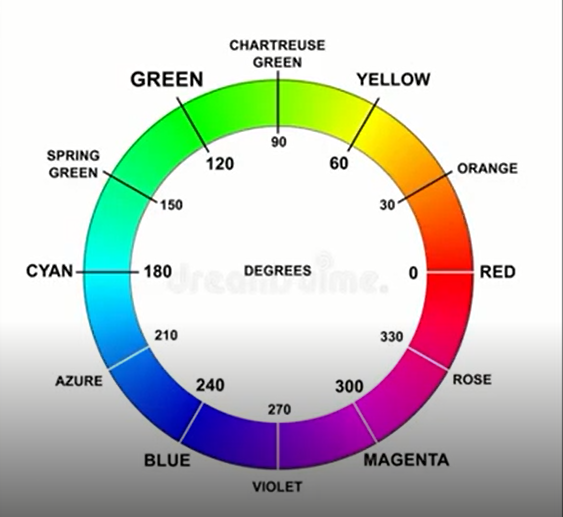

# Apresentação à Estilização Básica com CSS
[Teacher](https://instagram.com/programi_)
## Cores

Os navegadores, de modo geral, disponibilizam cerca de 140 cores para usarmos.

Existem diversas formas de definir cores através do CSS. Nessa seção, vamos explorá-la.


### Cores Pré-Definidas
A forma mais básica de usar cores no CSS são as cores pré-definidas. 

Como assim? Você simplesmente escreve o nome da cor em inglês e consegue usá-las.

Considere o seguinte código HTML.

```
<body>
    <p>Código de teste</p>
</body>
```

CSS aplicado:

```
<style>
    p {
        color: red;
    }
</style>
```
Red é vermelho em portugês. Em outras palavras, você só precisa saber o nome da cor que deseja em inglês para usá-la.

Existem diversas nomes de cores pré-definidos. Clique no link abaixo para saber mais:

[Mais nomes de cores](https://w3schools.com/colors/colors_names.asp)

Além disso, nós podemos usar a palavra reservada **transparent** no lugar do nome da cor pré-definida.

Exemplo:

```
<style>
    p {
        color: transparent;
    }
</style>
```
Como o próprio nome diz, fará com que a cor do conteúdo do elemento fique transparente, fazendo com que a cor do elemento pai apareça sobre aquele elemento.

Dependo da situação, é interessante reutilizar a cor do elemento para outras propriedades CSS também. 

Como assim? Imagine que você definiu a cor do conteúdo de determinado elemento como **orange**.

```
p {
    color: orange;
}

``` 
Se você quiser reutilizar essa cor para uma borda no mesmo elemento, você pode utilizar a palavra reservada **currentcolor**;

```
p {
    color: orange;
    border: 1px solid currentcolor;
}

``` 
**currentcolor** sempre utiliza a cor do elemento como base.

***

### RGB e RGBA

A segunda forma de utilizar cores no CSS é através do **RGB**. O RGB é uma sigla que significa: Red, Green e Blue(Vermelho, Verde e Azul). 

Para desenvolvimento web, as cores primárias sempre serão vermelho, verde e azul. Com isso em mente, você deve entender que o RGB é uma função que nos permite mudar os tons de vermelho, verde ou azul num elemento, permitindo a criação de novas cores.
```
p {
    color: rgb(255,255,255);
}
```
Veja que nós temos 3 números dentro da função:

* O primeiro número refere-se à quantidade de vermelho na nossa cor.
* O segundo número refere-se à quantidade de verde na nossa cor.
* O segundo número refere-se à quantidade de azul na nossa cor.

Esse números vão de 0 à 255 permitindo que nós criemos qualquer cor. 0 é a ausência daquela cor na mistura das cores e 255 é o máximo de intensidade daquela cor.

Você também pode definir o RGB através de porcentagem.

Exemplo:
```
p {
    color: rgb(100%,0%,100%);
}
```
Assim fica fácil de entender, não é mesmo? 0% mínimo, 100% máximo. Porém, na prática, essa notação não é comum.

Dito isso, podemos falar do RGBA. Você se lembra que mencionamos o valor especial **transparent** na última seção? Pois é, ele definia que a propriedade seria transparente.

O RGBA nada mais é do que o RGB + um número extra para transparência.

```
p {
    background-color: rgba(255,0,255, 1);
}
```
O último número vai de 0 a 1, onde 0 é o máximo de transparência e 1 é a ausência de transparência.


***

### Hexadecimal

Outra forma de adicionar cores aos elementos HTML. É usando códigos decimais.

```
p {
    color: #F1F1F1;
}
```
Para usá-los, basta colocar um jogo da velha(**#**) e inserir o código hexadecimal desejado. Esse código possui 6 caracteres.

Leve em consideração que se você colocar o valor: *#000000*, estará representando a cor preta. Da mesma forma, se você colocar o valor: *#FFFFFF*, estará representando a cor branca, uma vez que o valor mínimo é 000000, e o máximo, FFFFFF.

Como temos 6 caracteres, temos 3 pares de caracteres, certo? Pois bem, cada par de caracteres representa uma cor primário no **desenvolvimento web**. 

Funciona parecido ao RGB:
* O primeiro par de caracteres representa a intensidade de **vermelho**.

* O segundo par de caracteres representa a intensidade de **verde**.

* O terceiro par de caracteres representa a intensidade de **azul**.

Se você quiser aplicar transparência aqui, basta adicionar mais um par de caracteres.

```
p {
    color: #F1F1F100;
}
```

Esse último par, representa o nível de transparência da propriedade, onde **00** é 100% transparente e **FF** é a ausência de transparência.
***

### HSL e HSLA

A última forma de trabalhar com cores no CSS é através do **HSL**. HSL significa Hue, Saturation, Lightness que em português seria: Matriz, Saturação e Luminosidade.

Ele é um pouco mais complicado, mas vamos busca entender cada propriedade uma a uma.

* **Hue(Matiz)**: Representa o grau da roda de cores que vai de 0 a 360 graus.
   * *Roda cores*: 

        


Como você pôde ver na figura acima, cada valor de 0 à 360 representa uma cor diferente.

    * 0 ou 360 representam vermelho.
    * 120 representa verde.
    * 240 representa azul.

Então o primeiro, valor da função HSL você já sabe, representa a cor(*MATIZ*).
```
p {
    color: hsl(120 , ,);
}
```

* **Saturation(Saturação)**: A saturação é um termo bem conhecido para quem trabalha com edição de imagem. Ela é o segundo valor da nossa função HSL e representa a saturação da nossa cor. Esse número é passado em porcentagem.

Mas... Como assim saturação? Saturação de um termo mais específico que diz respeito à intensidade da cor. Uma saturação de 100%, por exemplo, significa que a cor ficará com toda sua intensidade. Se a saturação for 0%, a cor ficará cinza independemente da cor que você pretendia usar.

Agora, o segundo número você já sabe, representa saturação da cor.
```
p {
    color: hsl(120 , 100% ,);
}
```

* **Lightness(Luminosidade)**: Como o próprio diz, controla a luz da cor. Esse número também é passado em porcentagem.

Se você coloca luminosidade de 0% em uma cor, ela fica preta. Porém, se você coloca luminosidade de 100%, ela fica branca. Essa é a forma que temos de criar as cores brancas e pretas através do HSL. 

O terceiro número você já sabe, representa saturação da cor.
```
p {
    color: hsl(120 , 100% , 50%);
}
```
Geralmente, a luminosidade de uma cor vem por padrão em torno de 50%.

Agora fica fácil de uma entender o HSLA, não é mesmo? Ele serve para adicionar nível de transparência a cor. Funciona exatamete igual ao RGB, 0 é o máximo de transparência e 1 é o mínimo.

```
p {
    color: hsla(120 , 100% , 50%, 1);
}
```
