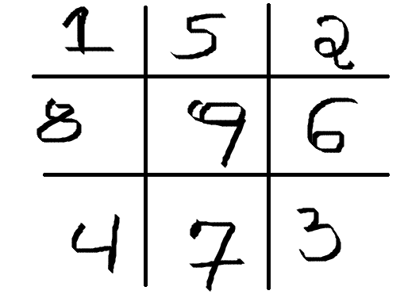

# Apresentação à Estilização Básica com CSS

## Bordas

Já mencionamos um pouco sobre a borda dos elementos. Essa borda faz parte da altura e largura dos elementos.

Veremos nesta seção como adicionar bordas aos nossos elementos e suas propriedade particulares.

### Tamanho da Borda 

Assim como a propriedade **background**, nós temos a propriedade **border** que é um **shorthand**. Ou seja, através dela, nós conseguimos definir propriedades mais específicas das bordas dos elementos.
```
p {
    border: 2px solid red;
}
```

Veja aqui nós estamos definindo a **largura** da borda através do primeiro valor da propriedade(2px), o **estilo** através do segundo(solid) e a **cor** através do terceiro(red).

Porém, nós podemos definir estes valores através de propriedades específicas para cada uma delas.

* *Como definir a largura da borda dessa forma?*

Através da propriedade **border-width**.
```
p {
    border-width: 2px;
}
```

* **thin**: Se nós quisermos que a largura da nossa borda seja de **1px**, nós podemos utilizar a palavra reservada **thin**.

* **medium**: Se nós quisermos que a largura da nossa borda seja de **3px**, nós podemos utilizar a palavra reservada **medium**.

* **thick**: Se nós quisermos que a largura da nossa borda seja de **5px**, nós podemos utilizar a palavra reservada **thick**.

Além disso, nós podemos definir uma largura de borda na vertical e na horizontal.

```
p {
    border-width: 2px 5px;
}
```
Neste caso, estamos definindo uma borda de **2px na vertical** e **5px na horizontal**

O que é isso?
```
p {
    border-width: 2px 5px 10px;
}
```
Neste caso, estamos definindo uma borda de **2px em cima**, **5px na horizontal** e **10px embaixo**

O que é isso?
```
p {
    border-width: 2px 5px 10px 15px;
}
```
Neste caso, estamos definindo uma borda de **2px em cima**, **5px na direita**, **10px embaixo** e **15px na esquerda**


* *Como definir o estilo da borda dessa forma?*

Através da propriedade **border-style**.
```
p {
    border-style: solid;
}
```
* *Como definir a cor da borda dessa forma?*

Através da propriedade **border-color**.
```
p {
    border-color: red;
}
```

Tome cuidado se quiser declarar os valores das propriedades dessa forma, pois se você usar o **border-width**, você precisa usar o **border-style** também. 

Caso contrário, não funcionará, pois para uma borda, nós precisamos definir, pelo menos, sua largura e estilo.
***

### Estilo da Borda 

Agora, vamos aprofundar um pouco mais na propriedade **border-style**. 

Como mencionado antes, se você declarar a largura da borda com a propriedade específica **border-width**, você precisará definir **border-style** e um estilo válido para ela.

Isso acontece, porque o valor padrão de **border-style** é **none**. 
```
div {
    border-style: none;
}
```

Vamos outros valores desta propriedade agora:

* **solid**: Cria uma borda contínua. A borda mais comum que vemos.
```
div {
    border-style: solid;
}
```
* **dashed**: Cria uma borda traçada, cheia de traços.
```
div {
    border-style: dashed;
}
```
* **dotted**: Cria uma borda pontilhada, cheia de pontos.
```
div {
    border-style: dotted;
}
```
* **double**: Cria duas bordas, uma mais interna e mais externa.
```
div {
    border-style: double;
}
```
* **groove**: Cria um efeito 3D na borda, lembra um botão pressionado.
```
div {
    border-style: groove;
}
```
* **ridge**: Igual o **groove**, mas inverte as cores do efeito 3D.
```
div {
    border-style: ridge;
}
```
* **inset**: Cria a impressão de elemento afundado na tela.
```
div {
    border-style: inset;
}
```
* **outset**: Faz o contrário de **inset**. Causa a impressão de elemento saindo da tela.
```
div {
    border-style: outset;
}
```

Além disso, a gente pode aplicar mais de um valor para essa propriedade.

* **border-style com 2 valores**:
```
div {
    border-style: outset dotted;
}
```
Neste caso, o valor **outset** será aplicado para a vertical, e **dotted**, para a horizontal.

* **border-style com 3 valores**:
```
div {
    border-style: outset dotted dashed;
}
```
Neste caso, o valor **outset** será aplicado para cima, **dotted**, para a horizontal, e **dashed** para baixo do elemento.

* **border-style com 4 valores**:
```
div {
    border-style: outset dotted dashed solid;
}
```
Neste caso, o valor **outset** será aplicado para cima, **dotted**, para a direita, **dashed** para baixo do elemento, e **solid** para a esquerda do elemento.

***

### Cor da Borda 

Agora, vamos falar um pouco de **border-color**, a propriedade específica que define a cor da borda.

Nesta propriedade, podemos definir a cor como em todos os outros exemplos que vimos até agora à respeito de cores: nome da cor específica, função RGB. função HSL ou definr por número hexadecimal;

Se você definir uma borda e não passar a cor, ela utilizará a cor do conteúdo do elemento como padrão.

Como definir a cor da borda?
```
div {
    border-color: red;
}
```

Podemos também definir 2 cores dentro dessa propriedade:
```
div {
    border-color: red purple;
}
```

Neste caso, será atribuído **red** para as vertical da borda e **purple**, para a horizontal da borda.

Podemos também definir 3 cores dentro dessa propriedade:
```
div {
    border-color: red purple blue;
}
```

Neste caso, será atribuído **red** para a parte de cima da borda, **purple**, para a horizontal da borda e **blue**, para a parte de baixo da borda.

Podemos também definir 4 cores dentro dessa propriedade:
```
div {
    border-color: red purple blue white;
}
```

Neste caso, será atribuído **red** para a parte de cima da borda, **purple**, para a direita da borda, **blue**, para a parte de baixo da borda e **white**, para a esquerda da borda.

***

### Propriedade Border 

Como citado no início da seção, se usarmos a propriedade **border**, podemos configurar, a largura, estilo e cor da borda de uma só vez:

```
p {
    border: 5px solid blue;
}
```

Porém, e se quisermos usar esta propriedade para definir tudo isso, mas cada lado da borda terá uma configuração diferente. Como fazer isso? Vamos ver isso agora!

* Configuração com a propriedade **border** para a parte superior da borda.
```
p {
    border-top: 2px dashed lightgreen;
}
```

* Configuração com a propriedade **border** para a parte inferior da borda.
```
p {
    border-bottom: 10px double yellow;
}
```

* Configuração com a propriedade **border** para a direita da borda.
```
p {
    border-right: 13px groove orange;
}
```

* Configuração com a propriedade **border** para a esquerda da borda.
```
p {
    border-left: 8px ridge orange;
}
```

Você pode especificar ainda mais. Por exemplo, imagine que você quer definir o estilo da parte superior da borda. Como fazer isso?
```
div {
    border-top-style: dashed;
}
```
***

### Arredondando os Cantos com a Propriedade Border Radius

Geralmente, os nossos elementos são quadrados por padrão, mas e se quisermos arredondar os cantos dos nossos elementos?

Para isso, nós temos a propriedade **border-radius**. Mesmo que você não tenha definido uma borda, ela vai alterar o arredondamento das pontas do elemento de acordo com o número em pixels que você passar. Quanto maior o número, maior será o ângulo de arredondamento.

```
div {
    border-radius: 25px;
}
```

Podemos passar **2** valores para essa propriedade:
```
div {
    border-radius: 25px 15px;
}
```

Neste caso, será definido um ângulo de **25px para o canto superior esquerdo e para o canto inferior direito**, e **15 para o canto superior direito e para o canto inferior esquerdo**

Podemos passar **3** valores para essa propriedade:
```
div {
    border-radius: 25px 15px 8px;
}
```

Neste caso, será definido um ângulo de **25px para o canto superior esquerdo**, **15px para o canto superior direito e para o canto inferior esquerdo** e **8px para o canto inferior direito**.

Podemos passar **4** valores para essa propriedade:
```
div {
    border-radius: 25px 15px 8px 2px;
}
```

Neste caso, será definido um ângulo de **25px para o canto superior esquerdo**, **15px para o canto superior direito**, **8px para o canto inferior direito** e **2px para o canto inferior esquerdo**.

Você também pode criar arredondamentos ovais, e não necessariamente circulares:
```
div {
    border-radius: 30px/50px;
}
```

Basta que você informe valores dividos por uma barra.

Você também pode utilizar porcentagem:
```
div {
    border-radius: 50%;    
}
```

DETALHE IMPORTANTE: UMA FORMA BEM ÚTIL DE CRIAR CÍRCULOS NO CSS É USANDO A PROPRIEDADE **BORDER-RADIUS** E **VALORES EM PORCENTAGEM**.
```
div {
    width: 200px;
    heigth: 200px;
    border-radius: 50%;
}
```
Veja que para criar um círculo perfeito, temos criar um elemento 100% quadrado primeiro, QUE A LARGURA E ALTURA TÊM VALORES IGUAIS. 

Quando aplicamos o **border-radius** com 50% de ângulo de arredondamento, temos um círculo perfeito.

### Propriedade Border Image Source

A propriedade **border-image** serve para adicionarmos imagem a nossa borda. Porém, assim como a propriedade **border**, ela é um **shorthand**.

Vamos ver algumas propriedades que derivam dessa propriedade:

* **border-image-source**: Seu valor padrão é **none**. Ela é útil para passarmos o caminho da imagem que será usada como borda. Porém, para que ela funcione, você deve definir o tamanho e a textura de uma borda, pelo menos.
```
border: 2px solid;
border-image-source: url(../assets/image/borda.png); 
```
Além disso, podemos usar gradientes nesta propriedade como visto no **background-image**.
```
border: 2px solid;
border-image-source: linear-gradient(red, blue); 
```

***

### Propriedade Border Image Slice

Uma vez, que nós temos uma imagem como borda, precisamos aprender a manipulá-la ou cortá-la em pedaços, se necessário. Fazemos isso através da propriedade **border-image-slice**.

Essa propriedade tem que ser testada no navegador usando o DevTools. Não há outra forma de defini-la.

Essa propriedade é extremamente complexa. Ela divide a imagem da borda em zonas que vão de 1 a 9.


* Os pontos de 1 a 4 são usados uma única vez para compor a imagem da nossa borda e **não** se **repetem**.
* Os pontos de 5 a 8 são usados para compor a imagem da nossa borda e podem se **repetir** à medida que você aumenta o valor da propriedade.
* A parte 9 é, por padrão, descartada da borda. Se habilitada, usando o valor **fill**, ela vai sobrepor o fundo do elemento.

Exemplo de uso da propriedade:
```
border-image-slice: 300 ;
```
Conforme você aumenta seu valor, os pontos da borda de 1 a 8 vão se esticando, mas mantendo a proporção.

Por padrão, a propriedade **border-image-repeat** vem desligada, mas se a ligarmos, os pontos de 5 a 8 vão se repetir, conforme explicado acima.

```
border-image-slice: 300 fill;
```
Podemos habilitar o ponto **9** passando a palavra **fill** depois do valor numérico, porém, isso sobrescreverá o fundo da imagem. 

***

### Propriedade Border Image Width

Se quisermos definir a **largura** da **imagem** da borda, usamos a propriedade **border-image-width**. Geralmente, usamos ela junto com o **border-image-slice**.

```
border-image-width: 5px;
```

Podemos definir isso isso passando 2 valores para essa propriedade. No caso, **o primeiro valor será para a vertical** e o segundo, **para a horizontal**.
```
border-image-width: 5px 10px;
```

Podemos definir isso passando 3 valores para essa propriedade. No caso, **o primeiro valor será para cima**, o segundo, **para a horizontal** e o terceiro, **para baixo**.
```
border-image-width: 5px 10px 7px;
```

Podemos definir isso passando 4 valores para essa propriedade. No caso, **o primeiro valor será para cima**, o segundo, **para a horizontal** , o terceiro, **para baixo** e o quarto, **para baixo**.
```
border-image-width: 5px 10px 7px 12px;
```
Você pode usar a palavra reservada **auto**. Um valor automático será passado,
```
border-image-width: auto ;
```
E valores em porcentagem.
```
border-image-width: 10% ;
```
***

### Propriedade Border Image Repeat
Se quisermos trabalhar a repetição da imagem da borda, podemos usar o já mencionado **border-image-repeat**. 

Essa propriedade aceita alguns valores:

* **stretch(padrão)**: **Estica** os cantos de 5 a 8 da imagem da borda, sem interferir nos cantos de 1 a 4.
```
border-image-repeat: stretch;
```
* **repeat**: **Repete** os cantos de 5 a 8 da imagem da borda, sem interferir nos cantos de 1 a 4.
```
border-image-repeat: repeat;
```
***
* **round**: **Redimensiona**  os cantos de 5 a 8 da imagem da borda para que não haja cortes, sem interferir nos cantos de 1 a 4.
```
border-image-repeat: round;
```
* **space**: **Estica**  os cantos de 5 a 8 da imagem da borda para que não haja cortes, sem interferir nos cantos de 1 a 4.
```
border-image-repeat: space;
```
Além disso, podemos definir o primeiro valor para o **eixo-x** e o segundo, para o **eixo-y**.
```
border-image-repeat: space round;
```

### Propriedade Border Image Outset

Por último vamos falar da propriedade **border-image-outset**. Ela define o distanciamento da imagem da borda para o espaçamento interno do elemento, padding.

```
border-image-outset: 10px;
```

Também aceita valores que não estão em pixels:
```
border-image-outset: 2;
```
Podemos passar 2 valores para ela. Sendo o **primeiro para a horizontal** e **o segundo**, **para a vertical**
```
border-image-outset: 20px 50px;
```
Podemos passar 3 valores para ela. Sendo o **primeiro para cima**, **o segundo**, **para a vertical** e**o terceiro**, **para baixo**
```
border-image-outset: 20px 50px 15px;
```
Podemos passar 4 valores para ela. Sendo o **primeiro para cima**, **o segundo**, **para a direita**, **o terceiro**, **para baixo** e **o quarto**, **para a esquerda** 
```
border-image-outset: 20px 50px 15px 8px;
```

***

## Border-Image

Vamos ver como usá-la como **shorthand** para todas essas subpropriedades mencionadas acima.

Dentro dessa propriedade, você precisa aplicar as subpropriedades na ordem:

1. border-image-source;
2. border-image-slice;
OPCIONAL: Colocar uma "/", depois de border-image-slice, e o valor de **border-image-width**
OPCIONAL: Colocar uma "/", depois de border-image-width, e o valor de **border-image-outset**
3. border-image-repeat;
Exemplo sem os opcionais: 

```
border-image: url(../assets/border.png) 160 round;
```
Exemplo com os opcionais: 

```
border-image: url(../assets/border.png) 160 / 24px 45px / 24 round;
```